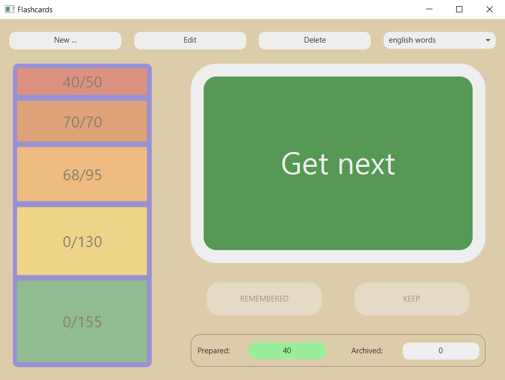

# flashcards

Application intended for learning new words using the Leitner method with a flashcard box
(described [**_here_**](https://en.wikipedia.org/wiki/Leitner_system)). Moreover, it also might be used for gaining any
different type of knowledge, if only it can be presented as relatively short questions and answers.

## Used technologies

- Java
- Spring Boot
- JavaFX
- Maven
- Lombok
- MySQL

## Requirements

- Installed JVM
- Available connection with MySQL database schema. On default `localhost:3306/flashcard-collection` in case of unchanged
  configuration properties.

## Presentation

View of the main window is shown below.

## Ideas for further development

- Use Docker container to make project independent on external database
- Suite flashcard representation and use JPA
- Tidy up all styles using CSS classes and slightly beautify GUI
